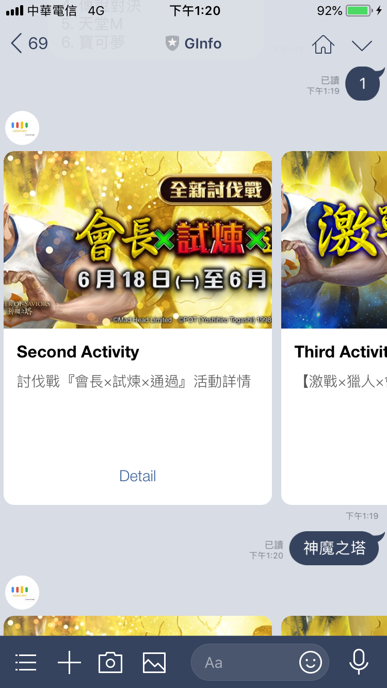

# LineBot-GInfo

GInfo是一個遊戲助手可以幫助您查詢遊戲的最新活動資訊。
使用python和LineSDK開發的聊天機器人。

## Command Keyword

* help : 使用方法和指令。

## User Guide

1. 呼叫遊戲列表可以打：你好, help

{: width="150px" height="270px"}

2. 查詢遊戲資訊： [遊戲編號(遊戲列表中的)或遊戲名稱]

{: width="150px" height="270px"}

3. 個人化功能：請使用更多資訊跳出選單：星星(我的最愛)，齒輪(提示設定指令)，信(作者email)

{: width="150px" height="270px"}
{: width="150px" height="270px"}
{: width="150px" height="270px"}

## Game Keyword

可以輸入其他遊戲簡稱來使用服務，以下為目前提供的遊戲服務：

* 神魔之塔
* FGO（Fate/Grand Order）
* RO (RO仙境傳說：守護永恆的愛)

## QRcode
